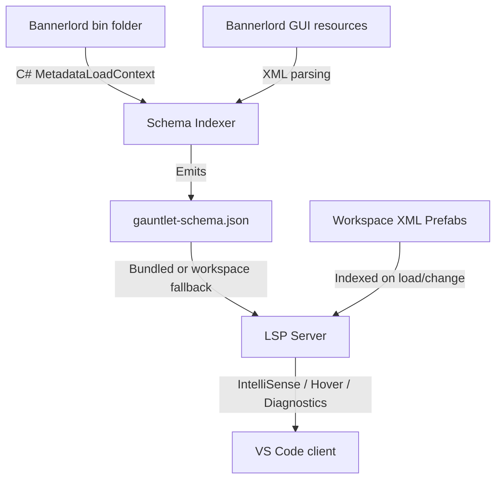

# GauntletUI LSP

An integrated VS Code extension and schema indexer providing IntelliSense (autocompletion, hover documentation, and diagnostics) for Mount & Blade II: Bannerlord **GauntletUI prefab XML** files.

## Project Structure

This repository is split into two main components:
1. **[Schema Indexer](./schema-indexer/) (C# Console App)**: Reflects over Bannerlord `.NET` assemblies using `System.Reflection.MetadataLoadContext` and parses game UI resources to generate a unified `gauntlet-schema.json` database.
2. **[VS Code Extension](./vscode-extension/) (TypeScript)**: The LSP client and server that consumes the generated schema to provide rich editor features without hijacking non-GauntletUI XML files.

---

## Architecture Overview



---

## 1. Schema Indexer (C#)
The schema indexer resides in `/schema-indexer`. It reflects over the game's assemblies to extract widgets, properties, and ViewModels, and parses XML files to extract brushes and sprites.

### Hard Constraints
* **No game binaries are committed:** Assemblies reside in a local, untracked `refs/` directory or are fetched from the local game path.
* **No assembly execution:** Uses `MetadataLoadContext` so it doesn't try to load native engines or execute game code.

### Running the Indexer
Run the indexer from the command line:
```bash
dotnet run --project schema-indexer/schema-indexer.csproj -- --game-bin-path "C:\Path\To\Bannerlord\bin\Win64_Shipping_Client" --resource-path "C:\Path\To\Bannerlord\Modules" --output "gauntlet-schema.json"
```

---

## 2. VS Code Extension (TypeScript)
The extension lives in `/vscode-extension`. It implements the Language Server Protocol (LSP) to provide completion, hover, and diagnostics.

### Features
* **Tag Completion**: Lists all native Widget tags (e.g. `ListPanel`, `TextWidget`) plus custom workspace prefab filenames.
* **Attribute & Value Completion**: Offers widget attributes with specific value hints (enums, boolean, brushes, sprites).
* **Context-aware Filtering**: Recommends `<Constant>` only inside `<Constants>`, and `@binding` / `Command.*` based on ViewModel context.
* **Diagnostics**: Highlights unknown widgets or invalid properties (toggleable).
* **Non-invasive**: Will ignore standard non-GauntletUI XML files (like `pom.xml` or Android layouts) by inspecting root tags.

### Building & Running the Extension
1. Install dependencies:
   ```bash
   cd vscode-extension
   npm install
   ```
2. Build the extension:
   ```bash
   npm run build
   ```
3. To package into an installable `.vsix`:
   ```bash
   npm run package
   ```

---

## Configuration Settings
Configure the following settings in your VS Code `settings.json`:
* `gauntletui.gamePath`: Path to the game directory (contains `bin` and `Modules`).
* `gauntletui.schemaPath`: Custom location for `gauntlet-schema.json`. Defaults to workspace root.
* `gauntletui.fileGlob`: Glob pattern for prefab activation (defaults to `**/GUI/**/*.xml`).
* `gauntletui.viewModelMapping`: Map prefab names to ViewModels for accurate binding autocompletion.
* `gauntletui.diagnosticsEnabled`: Toggle diagnostics warnings (defaults to `true`).

## License
MIT
